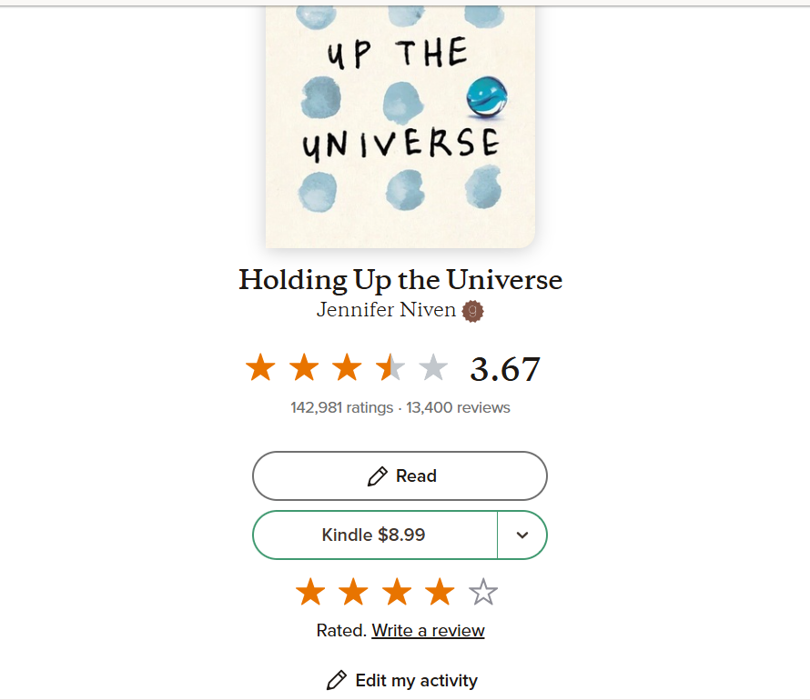
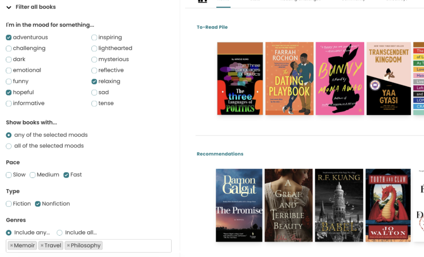
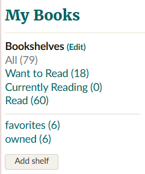
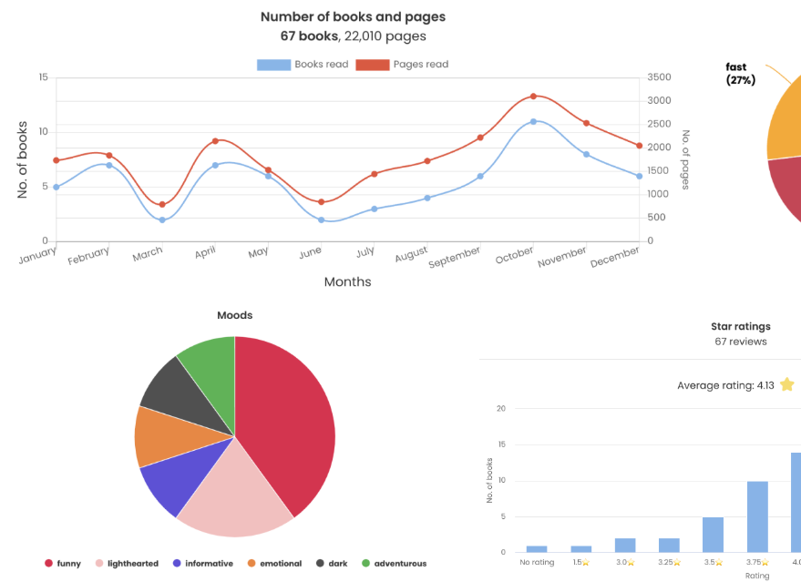
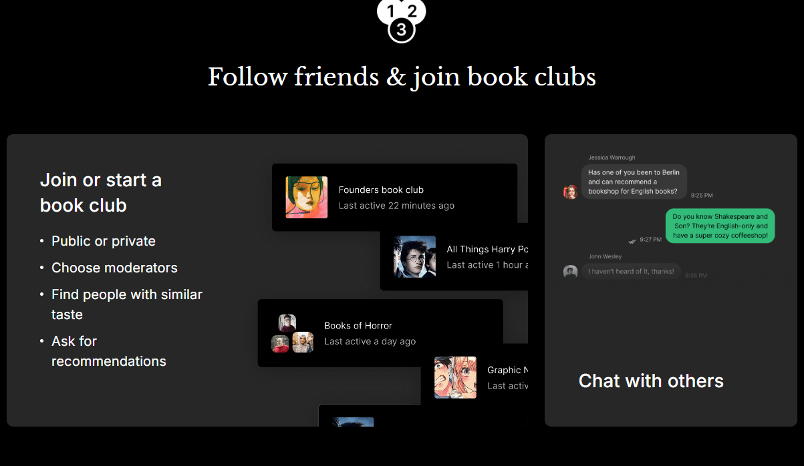

# PagePal: A Friend for Every Chapter

---

# Quick Links
1. [Homepage](./tutorial.md)
2. [Basic Overview](./tutorial.md)
3. [Project Strucure](./projectStructure.md)
4. [Project Setup](./setup.md)
5. [Practice](./practice.md)
6. [Homepage](./index.md)
7. Proposal *(current)*

## Project Description: 
This app is designed for readers that intend on tracking the progress of books they’ve read, as well as helping the user incorportate reading into their daily routine by making it a more enjoyable experience. To accomplish this, the app would enhance the reading experience by adding **mood-based tracking, paragraph tracking,** as well as **user statistics** that would help give the user **personalized recommendations**. 

Additionally, a fun feature to include would be to incentivize the user's reading experience by adding **badges** to unlock by completing certain challenges. An example would be an **"Early Bird" badge** that users could earn by reading within the early hours of the day.

These pictures, gathered from referenced apps below, showcase the general vision I have for my project. 

### Book ratings:

### Keyword search:

### Bookshelves:

### Statistics:

### Book Clubs:

---

## Similar Existing Solutions
1. Goodreads[1]

    **Goodreads** is a popular website used amongst readers to **log the books they’ve read, want to read, find recommendations, and share thoughts and reviews with friends and other readers.** With this, there is a feature I really like that has a tab to display the users' **"bookshelf."** This is great feature for organization purposes-- the user would be able to find their bookshelves that fit into a certain category, such as a "favorites" shelf, or a "Currently Reading" shelf.

    I’ve used Goodreads for quite some time, and it doesn’t exactly hit every checkmark I need in a book tracking app. It has some general things I want to implement, such as logging books, finding recommendations, and reviewing books with friends. However, when making recommendations, there is not an option to give **half stars**, so I would for sure like to add that detail in my own app. 

2. Bookly[2]

    **Bookly** is primarily used for *staying motivated and keeping a consistent routine when reading*. Additionally, users can **keep a catalog of all the books they’ve read. Using personalized statistics, the app elevates the reading experience.** In the main layout, the user has many options to choose from. Doing something like this would make the app easy to navigate in order to enjoy all the features within the app. 

    I used to own this app, which inspired the vision for creating my own. Overall, I love the idea of an app helping a user with creating routines—which is something I want my app to include. User statistics are great for the user, and also for the app to help create a personalized experience. I want my app to be a seamless, stress free experience to set goals and reach reading milestones.
    
3.	The StoryGraph[3]

    **TheStoryGraph** is a good app for **reading tracking, as well as a tool to help find your next read.** This app relies heavily on statistics to see how the user’s reading develops over time to help the user pick books based on their statistics. Another feature includes a catalog of books that users can search through by specific keywords to find their perfect next read.

    This app has a lot that I love about it. This is the closest app to my vision, as it includes statistics, reviews and recommendations, and a friend system. I think one of the few things it lacks is an incentive to reading. In my app, I want to incentivize this process by adding a badge feature to earn as the user progresses through their reading journey.

4. Bookmory[4]

    **Bookmory** is another reading tracker that offers **book registration via search and barcode, page and time tracking, book genre organization, a reading calendar, notes, reviews, and a goal setting.** These statistics and features help elevate the reading experience by making it a more organized activity for those who wish to have an organized experience. 

    There’s a lot of similarities between my vision and what Bookmory has to offer. I like that there is a book registration feature, so if there’s a way for me to add that in my own app, it would be really nice to have. Apart from that, it is pretty similar to previous apps I have explored 

5.	Fable[5]

    **Fable** is a unique reading app that creates a community of readers within the app. Users can join **user-created book clubs, import books and discuss them in-app along with other users.** The goal of Fable is to make reading more **social and enjoyable** for users—which is fairly similar to the goal of my project as well.

    I really like the idea of book clubs, which is something I could consider if I have the time for it. I feel as if it would be good for community engagement. Sometimes it is nice to be able to read alongside other users if they are unable to attend an in-person book club. This is definitely something I will consider if I have the time to do it.

6.	Literal.club[6]

    **Literal.club** is an app designed to **track what you’re reading, connect with friends, and also join in-app book clubs to engage with the reading community.** Some additional features include setting individual reading goals, organize your personal library, creating highlights and notes. The only unique feature of this app is the book clubs, and I think that is what sets it apart from others.

    Like Fable, Literal.club’s book clubs are a cool feature that I won’t prioritize but would be a nice and cool feature. Something similar would be that I plan on including in-app goals that readers can set, as I believe setting a goal can lead to a successful reading habit. Apart from that,

7.	LibraryThing[7]

    **LibraryThing** is a free-to-use website where users can **add books, movies, and music, among other imports from libraries, to track, rate, and review books.** Additionally, users can join groups and discuss the forms of media with other users, along with the ability to see detailed statistics about the users’ library and reading journey. It is fairly similar to the other apps, but is different in the sense that it is a website, rather than an app, and also features non-literature, such as music.

    I like what the website has to offer, as it offers statistics, recommendations, and overall personalizations based on what the user has read and reviewed. This is what I want to do, but I want to make it more fun for the user. In my opinion, I do not like how the layout looks, so that is something I would do different. I would like to focus on making the main homescreen more organized with cooler tones, rather than warmer to give a more polished and modern look.

---

# Technologies

## Platform
- **Mobile app**
    - While I could have created a website, I felt that an app would be best for what I want to do, as it can feel more personal. It is easier to access on a handheld device, and if I wanted to add a feature for reminders, a mobile app would be the best alternative. 

---

## Programming Languages
- **Kotlin**
    - Essential for Mobile App Development. Can also be used for multiplatform development-- which I will be aiming for whilst utilizing Kotlin Multiplatform. (see below) It is very flexible and I am more familiar with it. 

---

### **Kotlin Multiplatform**[8]

A technology that allows you to write code once and then reuse it anywhere. KMP supports various operating systems, such as Andriod and IOS, Windows, macOS, and Linux. Paired with Compose Multiplatform, I can at least get the bare minimum of what I need to successfully build this app.

---

## Frameworks or Libraries
-	**Frameworks** (a library that offers the required fundamental structure to create mobile applications for a specific environment, i.e., a layout.)
    - **Compose Multiplatform**[9]
        - UI framework by Jetbrains-- smooth scrolling, responsive text editing, and platform-specific gesture support. Can easily access native APIs

-   **Libraries** (a collection of pre-written code or functions that developers can use to build applications.)
    - **SQLDelight**[10]
        - Database library for structured local storage
        - Easy schema managament
    - **Ktor**[11]
        - Can be used to integrate external services, such as the Google Books API, Open Library API

--- 

#### Other previous considerations:
- **Android Native**[12]
    - Good for an Android-only focus, and also there is full access to platform APIs. It uses the Kotlin language, as well as Java if preferred. The downside for using this, however, is that it would only work on Android and is not versatile.

- **Flutter**[13]
    - Good for cross-platform Android and iOS development. People gravitate toward this because of its rich UI, the smooth animations, and consistency across platforms. It would use the Dart language, but this would have an huge learning curve that, given the time constraints, I unfortunately do not think I have the time for this.

- **JavaScript**
    - Used for creating interactive and dynamic elements—very versatile. It is pretty versatile, and is typically used for web-based applications. As stated before, is something I considered doing but just does not fit my ideas.

---

# References

[1] Goodreads, *Goodreads*. [Online]. Available at: https://www.goodreads.com/

[2] Bookly, *Bookly*. [Online]. Available at: https://getbookly.com/  

[3] The StoryGraph, *The Storygraph*. [Online]. Available at: https://thestorygraph.com/

[4] Bookmory, *Bookmory*. [Online]. Available at: https://bookmory-reading-tracker.en.softonic.com/android?ex=RAMP-3538.0&rex=true

[5] Fable, *Fable*. [Online]. Available at: https://fable.co/interactive-reading

[6] Literal.club, *Literal.club*. [Online]. Available at: https://literal.club/

[7] LibraryThing, *Literal.club*. [Online]. Available at: https://www.librarything.com/

[8] Kotlin Multiplatform, *Kotlin Multiplatform*. [Online]. Available at: https://www.jetbrains.com/kotlin-multiplatform/

[9] Compose Multiplatform, *Compose Multiplatform*. [Online]. Available at: https://www.jetbrains.com/compose-multiplatform/

[10] SQLDelight, *SQLDelight*. [Online]. Available at: https://sqldelight.github.io/sqldelight/2.1.0/multiplatform_sqlite/

[11] Ktor, *Ktor*. [Online]. Available at: https://ktor.io/docs/welcome.html

[12] Native, *Android Native*. [Online]. Available at: https://developer.android.com/ndk/

[13] Flutter, *Flutter*. [Online]. Available at: https://flutter.dev/

---

[<- Back to Home](./index.md)