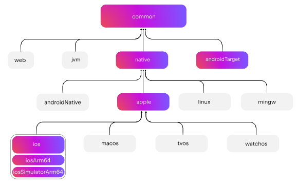

# Quick Links
1. [Homepage](./tutorial.md)
2. [Getting Started](./gettingStarted.md)
3. Project Strucure *(current)*
4. [Project Setup](./setup.md)
5. [Practice](./practice.md)
6. [Homepage](../index.md)
7. [Proposal](../proposal.md)

---

Once you have the project imported and set up, a typical KMP project should look like this:

| Directory | Purpose |
|------------|----------|
| **commonMain** | Code shared across all platforms, such as business logic, repositories, etc. |
| **androidMain** | Android-specific code |
| **iosMain** | iOS-specific code |
| **shared** | Gradle module; holds all shared code. It builds a framework (for iOS) or library (for Android) |

```
project-root/
├── androidApp/           # Android UI + platform integration
├── iosApp/               # iOS UI + platform integration
└── shared/               # Shared KMP module
    ├── src/commonMain/
    ├── src/androidMain/
    ├── src/iosMain/
    └── build.gradle.kts
```

---

## Understanding Hierarchical Project Structure

Kotlin Multiplatform projects support hierarchical source set structures.

*What does this mean?*

You can arrange a hierarchy of source sets for sharing the common code among supported targets. These source sets help provide a specific API for some targets. Using these source sets helps users to:
    - Share code across multiple targets
    - Consume a specific API for some targets
    - Use platform-dependent libraries in your project

This is beneficial, as it ensures that each source set has access only to the API that is available for all targets to which that source set compiles. This would prevent large errors, such as a Windows-specific API existing, and then compiling it to macOS.

Consider this code in `build.gradle(.kts)` file in the project's module, which should contain shared code:

```kotlin
kotlin {
    androidTarget()
    iosArm64()
    iosSimulatorArm64()
}
```
When declaring targets, `androidTarget`, `iosArm64`, and `iosSimulatorArm64` in your code, the Kotlin Gradle plugin will find a suitable shared source set from the template and create them for you, creating what is known as the **Default Hierarchy Model**

The Kotlin Gradle plugin actually has a built-in default hierarchy template that contains predefined intermediate source sets. This plugin will set up those source sets automatically, based on the targets that are specified in your project.

[Jetbrains provides a deeper explanation](https://www.jetbrains.com/help/kotlin-multiplatform-dev/multiplatform-hierarchy.html#default-hierarchy-template), as well as some images that properly document what the[hierarchical structure generally looks like. It should essentially look like this:



Next, we will discuss the setup process for setting up a shared model, as well as the testing process.

---

### [-> Setup Process](./setup.md)

---

### [<- Back to Home](../index.md)